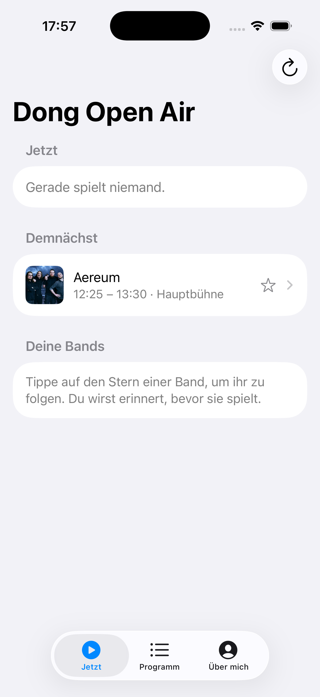
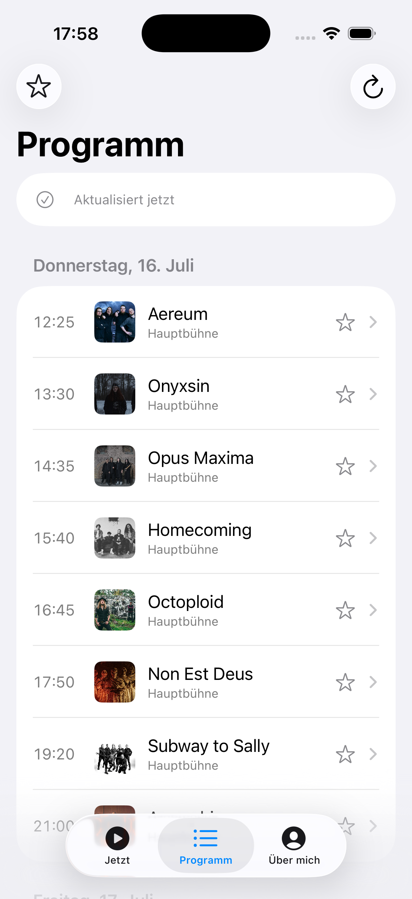
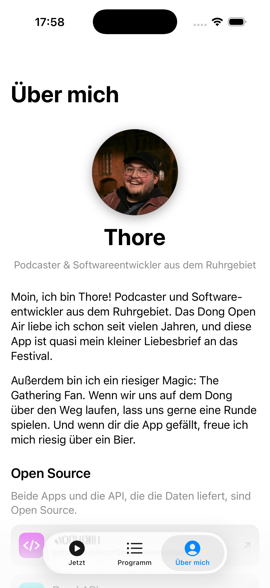

# Mountain

An unofficial, offline-first companion app for the **[Dong Open Air](https://www.dongopenair.de)** metal festival. Browse the running order, favorite the bands you don't want to miss, and get a reminder before they hit the stage — even with no signal on the festival grounds.

Built with SwiftUI for iOS 26, fully bilingual (Deutsch 🇩🇪 / English 🇬🇧).


| Now & Next | Line-up | About |
|:---:|:---:|:---:|
|  |  |  |

## Features

- **Now & Next** – see what's playing right now and what's coming up on each stage, plus your favorited bands' upcoming sets. Updates itself live.
- **Running order** – the full schedule grouped by day, filterable to just your favorites.
- **Favorites** – star any band. Stored separately from the schedule, so refreshing the line-up never touches your picks.
- **Reminders** – an optional local notification 15 minutes before a favorited band plays.
- **Offline-first** – ships with a bundled schedule snapshot and caches every update on disk. Works fully without a connection; an internet connection only pulls fresh data.
- **Bilingual** – German is the default language, English is fully supported. Follows the device language.

## Data & API

The line-up data comes from a small read-only JSON API:

- **API:** [github.com/KurzGedanke/band-api](https://github.com/KurzGedanke/band-api)
- **Festival endpoint:** `https://bands.baphomet.club/api/festivals/dong-open-air-2026/bands`

Both the app and the API are open source.

## Tech

- **SwiftUI** targeting **iOS 26**, **Swift 6** language mode with `MainActor` default isolation.
- **Observation** (`@Observable`) stores for the line-up, favorites, and reminders.
- **Offline cache** via a `Codable` snapshot in Application Support; favorites in `UserDefaults`.
- **Localization** via a String Catalog (`Localizable.xcstrings`), source language German.
- No third-party dependencies.

## Build & run

Requirements: **Xcode 26.5** or newer (iOS 26 SDK).

```sh
git clone https://github.com/KurzGedanke/mountain.git
cd mountain
open mountain.xcodeproj
```

Then select the `mountain` scheme and run on a simulator or device.

> **Signing:** the project ships with a `DEVELOPMENT_TEAM` set. To run on a physical device, change it to your own team under *Signing & Capabilities* (or set it to "None" for the simulator).

## Contributing

Issues and pull requests are welcome. For bug reports you can also reach me directly at **app@kurzgedanke.me**.

## About

Made by **Thore** — podcaster and software developer from the Ruhr area, longtime Dong Open Air enjoyer.

- Mastodon: [@kurzgedanke@chaos.social](https://chaos.social/@kurzgedanke)
- Bluesky: [@kurzgedanke.de](https://bsky.app/profile/kurzgedanke.de)

If you enjoy the app, come find me at Dong for a round of Magic: The Gathering (or a beer 🍻).

## License

[MIT](LICENSE) © 2026 Thore Jahn
